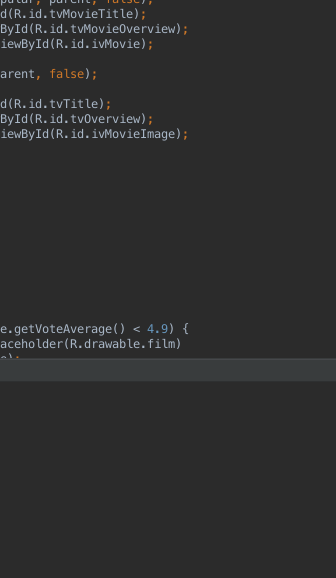

# Assignment 1 Flickster Movie App

Uses the movie database api to display movies currently playing
Submitted by: Zach Boline

Time spent: a few hours

## User Stories

The following **required** functionality is completed:

* [x] User can view a list of movies (title, poster image, and overview) currently playing in theaters from the Movie Database API
* [x] Lists should be fully optimized for performance with the ViewHolder pattern.
* [x] Views should be responsive for both landscape/portrait mode.

The following **optional** features are implemented:
* [x] Add pull-to-refresh for popular stream with SwipeRefreshLayout
* [x] Display a nice default placeholder graphic for each image during loading (read more about Picasso)
* [x] For popular movies (i.e. a movie voted for more than 5 stars), the full backdrop image is displayed. Otherwise, a poster image, the movie title, and overview is listed. Use Heterogenous ListViews and use different ViewHolder layout files for popular movies and less popular ones.
* [x] Expose details of movie (ratings using RatingBar, popularity, and synopsis) in a separate activity.
* [ ] Add a rounded corners for the images using the Picasso transformations.
* [x] Tweak the style improving the UI / UX, play with colors, images or backgr$

The following **additional** features are implemented:

* [ ] List anything else that you can get done to improve the app functionality!

## Video Walkthrough

Here's a walkthrough of implemented user stories:

GIF created with [LiceCap](http://www.cockos.com/licecap/).

I had some issues once I implemented the popular movie layout on the heterogenous list, notably when scrolling back up to the top, some of the "unpopular" items were being placed re-laid-out into the "popular" layout
